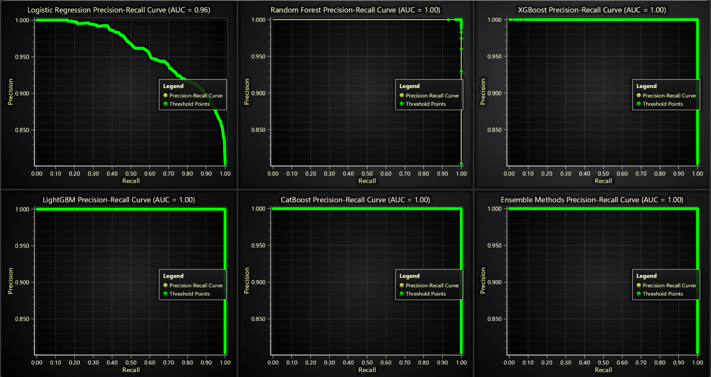

# Python Oceanography Analysis Data Application

## Introduction

Oceanography, the study of oceans, involves examining various aspects of marine environments such as tides, waves, temperature, and wind conditions. Data from these parameters is vital for marine scientists, environmentalists, and maritime industries to understand the behavior and dynamics of marine ecosystems.

Oceanographic data analysis involves gathering, processing, and interpreting data from the marine environment to gain insights into various oceanic processes. This data can provide information about wave patterns, temperature variations, and salinity levels. Oceanographic data is crucial for understanding marine ecosystems, predicting weather and climate patterns, and supporting navigation and maritime industries. It helps scientists monitor environmental changes, assess the health of marine habitats, and mitigate the impacts of climate change on coastal regions.

By visualizing oceanographic data, patterns and trends become more apparent, allowing for quicker interpretation and decision-making. Through graphical representations, complex datasets can be broken down into understandable formats that reveal relationships between variables such as wind speed, sea surface temperatures, and wave heights.

### Key Oceanographic Variables

- **Swell Height and Direction**: Understanding wave dynamics is crucial for coastal planning, surfing, and marine navigation.
- **Wind Speed and Direction**: Winds over oceans drive surface currents and affect wave heights.
- **Tidal Changes**: Tidal analysis helps predict water levels in coastal regions, essential for flood management.
- **Precipitation**: Rainfall over oceans affects salinity and influences water mass circulation.
- **Humidity and Pressure**: Atmospheric parameters impact weather patterns and storm formation.
- **Cloud Over**: Influences solar radiation absorption, affecting sea surface temperature.
- **Water Temperature**: A critical parameter in oceanography, influencing marine life and weather systems.

### Applications of Oceanographic Data

- **Marine Science**: Monitoring ocean health, analyzing ecosystems, and tracking pollution.
- **Weather Forecasting**: Predicting storms, cyclones, and ocean heat waves.
- **Maritime Operations**: Supporting shipping industries with route planning and safety measures.
- **Environmental Protection**: Managing coastal zones and mitigating the impacts of rising sea levels.

## LightningChart Python

### Overview of LightningChart Python

LightningChart is a high-performance charting library designed for handling large datasets and real-time visualization. In this project, it was used to create various types of charts for visualizing oceanographic data, from histograms to heatmaps and real-time graphs.

### Features and Chart Types Used in the Project

For this project, we'll leverage several powerful features of LightningChart to model and visualize solar power generation data effectively:

- **Feature Importance Diagrams**: were created to assess which variables (e.g., windspeed, swell height) are the most influential in predicting sea conditions using different models like Random Forest, Logistic Regression, and XGBoost. This allows us to better understand which oceanographic metrics have the most significant impact on marine systems.
- **Histograms**:illustrate the distribution of oceanographic variables such as windspeed, swell height, and humidity. These charts help identify the range and frequency of different values in the dataset, making it easier to analyze trends in ocean conditions.
- **Radar Charts**: display the relationship between moon phases and wave height. This chart reveals the correlation between lunar illumination and wave heights, which is important for understanding tidal forces.
- **Pair Plots and Scatter Charts**: were used to show the relationships between different variables, such as windspeed versus wave height or temperature versus humidity. These visualizations help identify correlations and patterns between multiple oceanographic variables.
- **Precision-Recall Curves**: highlight the performance of various machine learning models in predicting oceanographic metrics. These curves are important for determining how well models like Random Forest or XGBoost perform in predicting accurate values for metrics such as wave height or windspeed.
- **Real-Time 3D Surface Plots**:were created to visualize wave heights over time dynamically. These plots provide a spatial and temporal view of sea conditions, which is crucial for real-time decision-making in maritime operations.
- **Heatmaps**: were employed to visualize predicted wave heights for different geographical locations in real time. This type of visualization can help predict potentially hazardous ocean conditions.
- **ROC Curves**: show how well machine learning models perform at distinguishing between different classes (e.g., extreme weather events). ROC curves are important for assessing model accuracy and ensuring reliable predictions.
- **Boxplots**: provide insights into the distribution of key metrics such as windspeed, temperature, and wave height. Outliers are also highlighted, giving further insight into extreme ocean conditions.
- **Range Area Charts**: were used to explore the correlation between temperature and windspeed over time. These charts help us understand how changes in temperature influence wind patterns, which can affect wave dynamics and marine weather systems.
- **Stacked Area Charts**: visualized the changes in tide levels for different beaches over time. This chart is essential for understanding tidal patterns, which affect coastal management and marine ecosystems.
- **Wind Speed and Wave Height Over Time**: displayed how these two parameters change throughout the day. Understanding this relationship is crucial for shipping, surfing, and coastal operations.

### Performance Characteristics

LightningChart’s ability to handle large datasets efficiently and in real-time makes it an excellent choice for visualizing complex oceanographic data. Its high-performance rendering ensures smooth interactions with even the most data-heavy charts.

## Setting Up Python Environment

### Installing Python and Necessary Libraries

To get started, ensure you have Python installed. Install the necessary libraries by running the following command:

```bash
pip install lightningchart==0.8.0
pip install numpy pandas sklearn xgboost lightgbm catboost
```

### Overview of Libraries Used

- **NumPy**: For numerical operations and handling arrays.
- **Pandas**: Provides data structures and data analysis tools.
- **LightningChart**: For creating high-performance data visualizations.
- **XGBoost, LightGBM, CatBoost**: For advanced machine learning algorithms.
- **Scikit-learn**: For implementing machine learning models.
- **SciPy**: Used for statistical functions, such as density estimation.
- - **time**: A Python standard library for handling time-related tasks.

### Setting Up Your Development Environment

1. **Set up your development environment by creating a virtual environment and installing the necessary libraries. This ensures that your project dependencies are isolated and manageable.
   
   ```bash
   python3 -m venv venv
   source venv/bin/activate  # On Windows use `venv\Scripts\activate`
   pip install -r requirements.txt
   ```

2. **Using Visual Studio Code (VSCode)**: Visual Studio Code is a popular code editor that offers a rich set of features to enhance your development workflow.

## Loading and Processing Data

### How to Load the Data Files

The dataset consists of various oceanographic metrics stored in CSV files. We used **Pandas** to load and preprocess these files, including filling missing values, merging datasets, and converting time columns into a suitable format.


  ```python
   import pandas as pd

   tide_data = pd.read_csv('tide.csv')

   merged_data = pd.merge(tide_data, other_data, on='idbeach')
   merged_data.fillna(method='ffill', inplace=True)
   ```

### Handling and Preprocessing the Data

To prepare the oceanographic data for analysis and modeling, we followed these steps:
1. **Loading Data**: Data was loaded using **Pandas** for efficient manipulation and inspection.
2. **Merging Datasets**: Merged tide, day forecast, and beach datasets based on `idbeach` and `iddayforecast`.
3. **Datetime Conversion**: Converted time columns to datetime objects for time-series analysis.
4. **Feature Selection**: Selected key oceanographic variables like swell height, wind speed, humidity, and water temperature.
5. **Data Cleaning**: Handled missing values using forward fill methods (ffill).
6. **Normalization**: Normalized features using MinMax scaling for consistent ranges across charts.

## Visualizing Data with LightningChart

### Introduction to LightningChart for Python

LightningChart provides an efficient way to visualize large datasets in real-time, crucial for applications like solar power modeling.

### Creating the Charts

## Wind Speed and Wave Height Over Time**:

This dual-line plot tracks wind speed and wave height over time, helping to visualize the relationship between the two variables. The results indicate that higher wind speeds often correlate with larger waves, which is essential for understanding how wind conditions affect wave dynamics.

Script Summary: 

```python
import pandas as pd
import lightningchart as lc

data = pd.read_csv('Dataset/hour_forecast.csv')
grouped = data.groupby('time').agg({'windspeed': 'mean', 'sigheight': 'mean'}).reset_index()

chart = lc.ChartXY(theme=lc.Themes.Dark, title='Wind Speed and Wave Height Over Time')
wind_speed = chart.add_line_series().set_name('Wind Speed').set_line_color(lc.Color(0, 0, 255))
wave_height = chart.add_line_series().set_name('Wave Height').set_line_color(lc.Color(0, 255, 0))

wind_speed.append_samples(x_values=grouped['time'], y_values=grouped['windspeed'])
wave_height.append_samples(x_values=grouped['time'], y_values=grouped['sigheight'])

chart.get_default_x_axis().set_title('Time').set_tick_strategy(strategy="Time")
chart.get_default_y_axis().set_title('Speed/Height')
chart.open()
   ```


## Range Plot of Temperature vs Wind Speed**:

The range plot visualizes the correlation between temperature and wind speed over time. This chart highlights the variability in both metrics and their potential influence on wave height and direction. Higher temperatures and wind speeds can lead to larger swell heights and more intense sea conditions.

Script Summary: 

```python
import lightningchart as lc
import pandas as pd

beach = pd.read_csv('Dataset/beach.csv')
forecast = pd.merge(pd.read_csv('Dataset/hour_forecast.csv'), 
                    pd.read_csv('Dataset/day_forecast.csv')[['iddayforecast', 'idbeach']], 
                    on='iddayforecast')
merged = pd.merge(pd.read_csv('Dataset/spot.csv'), beach[['idbeach', 'name']], on='idbeach')
final_data = pd.merge(merged, forecast[['time', 'temperature', 'windspeed', 'idbeach']], on='idbeach')

temp_wind = final_data.groupby('time').agg({'temperature': ['min', 'max'], 'windspeed': ['min', 'max']}).reset_index()
temp_min, temp_max = temp_wind['temperature']['min'].tolist(), temp_wind['temperature']['max'].tolist()
wind_min, wind_max = temp_wind['windspeed']['min'].tolist(), temp_wind['windspeed']['max'].tolist()

chart = lc.ChartXY(title="Temperature vs. Windspeed Correlation", theme=lc.Themes.Dark)
chart.add_area_range_series().set_name('Temperature Range').add_arrays_high_low(temp_max, temp_min).set_fill_color(lc.Color(255, 255, 0))
chart.add_area_range_series().set_name('Windspeed Range').add_arrays_high_low(wind_max, wind_min).set_fill_color(lc.Color(50, 205, 50))

chart.get_default_x_axis().set_title('Time')
chart.get_default_y_axis().set_title('Value')
chart.open()
   ```


## Moon Phase vs Wave Height and Moon Illumination**:

This radar chart compares moon illumination and wave height across different moon phases. It highlights that during full moon phases, both wave height and moon illumination tend to be at their highest, suggesting a possible correlation between lunar phases and ocean conditions.

Script Summary: 

```python
import lightningchart as lc
import pandas as pd

day_forecast = pd.read_csv('Dataset/day_forecast.csv')
hour_forecast = pd.read_csv('Dataset/hour_forecast.csv')
merged_data = pd.merge(day_forecast, hour_forecast[['iddayforecast', 'sigheight']], on='iddayforecast')

moon_phase_data = merged_data.groupby('moon_phase').agg({'moon_illumination': 'mean', 'sigheight': 'mean'}).reset_index()
moon_phases = moon_phase_data['moon_phase'].tolist()
illumination_values = moon_phase_data['moon_illumination'].tolist()

wave_height_values = moon_phase_data['sigheight'].tolist()
scaled_wave_height = [(value - min(wave_height_values)) / (max(wave_height_values) - min(wave_height_values)) * 20 for value in wave_height_values]

chart = lc.SpiderChart(theme=lc.Themes.White, title='Moon Phase vs Wave Height and Moon Illumination')
for phase in moon_phases:
    chart.add_axis(phase)

chart.add_series().set_name('Moon Illumination').add_points([{'axis': phase, 'value': val} for phase, val in zip(moon_phases, illumination_values)])
chart.add_series().set_name('Wave Height (Scaled)').add_points([{'axis': phase, 'value': val} for phase, val in zip(moon_phases, scaled_wave_height)])

chart.open()
   ```


## Tide Levels Over Time Across Beaches:

This stacked area chart tracks tide levels at different beaches over time. It clearly shows the cyclic nature of tides, with regular peaks and troughs. Beaches like Santinho and Mole show significant fluctuations, which are crucial for understanding tidal patterns and predicting sea level changes.

Script Summary: 

```python
import pandas as pd
import numpy as np
import lightningchart as lc

tide_data = pd.read_csv('Dataset/tide.csv')
beach_data = pd.read_csv('Dataset/beach.csv')
day_forecast = pd.read_csv('Dataset/day_forecast.csv')

merged_tide = pd.merge(pd.merge(tide_data, day_forecast, on='iddayforecast'), beach_data, on='idbeach')
merged_tide['time'] = pd.to_datetime(merged_tide['time'])

pivot_tide = merged_tide.pivot_table(index='time', columns='name', values='height', aggfunc='mean').fillna(method='ffill')
time_values = pivot_tide.index.astype(np.int64) // 10**9

chart = lc.ChartXY(theme=lc.Themes.White, title='Tide Levels Over Time Across Beaches')
base_area = np.zeros(len(time_values))

for beach in pivot_tide.columns:
    cumulative_heights = base_area + pivot_tide[beach].fillna(0).values
    chart.add_area_series(data_pattern='ProgressiveX').set_name(beach).add(time_values.tolist(), cumulative_heights.tolist())
    base_area = cumulative_heights

chart.get_default_x_axis().set_title('Time').set_tick_strategy('DateTime')
chart.get_default_y_axis().set_title('Tide Height (m)')
chart.add_legend(data=chart).open()
   ```


## Box Plot of Sea Metrics: 

This box plot compares the distributions of critical ocean metrics like temperature, wind speed, and humidity, excluding outliers. For example, the swell height plot shows most of the values concentrated in a narrow range, with a few higher values indicating potential extreme sea conditions.

Script Summary: 

```python
import pandas as pd
import numpy as np
import lightningchart as lc

data = pd.read_csv('Dataset/hour_forecast.csv')
columns = ['temperature', 'windspeed', 'sigheight', 'humidity', 'feelslike', 'swellheight']

dataset, x_outliers, y_outliers = [], [], []

chart = lc.ChartXY(theme=lc.Themes.Dark, title='Box Series')
chart.set_series_background_color(lc.Color(0, 255, 255))

for i, col in enumerate(columns):
    col_data = data[col].dropna().tolist()
    start, end = (i * 2) + 1, (i * 2) + 2
    lower_q, upper_q = np.percentile(col_data, [25, 75])
    median, min_val, max_val = np.median(col_data), np.min(col_data), np.max(col_data)
    dataset.append({'start': start, 'end': end, 'lowerQuartile': lower_q, 
                    'upperQuartile': upper_q, 'median': median, 'lowerExtreme': min_val, 'upperExtreme': max_val})

    iqr = upper_q - lower_q
    lower_bound, upper_bound = lower_q - 1.5 * iqr, upper_q + 1.5 * iqr
    outliers = [y for y in col_data if y < lower_bound or y > upper_bound]
    x_outliers += [start + 0.5] * len(outliers)
    y_outliers += outliers
chart.add_box_series().add_multiple(dataset)
chart.add_point_series(sizes=True, rotations=True).set_point_color(lc.Color('red')).set_point_shape(
    "triangle").append_samples(x_outliers, y_outliers, [10] * len(y_outliers))

chart.open()
   ```


## Pair Plot: 

The pair plot matrix explores relationships between various oceanographic features like temperature, wind speed, and swell height. The scatter plots indicate potential correlations, such as wind speed vs. swell height, which may help predict wave conditions based on wind metrics. Density plots on the diagonal provide a distribution of each feature.

Script Summary: 

```python
import pandas as pd
import numpy as np
import lightningchart as lc
from scipy.stats import gaussian_kde

hour_forecast_data = pd.read_csv('Dataset/hour_forecast.csv')
day_forecast_data = pd.read_csv('Dataset/day_forecast.csv')
merged_data = pd.merge(hour_forecast_data, day_forecast_data[['iddayforecast', 'idbeach']], on='iddayforecast')

features = ['temperature', 'windspeed', 'sigheight', 'humidity', 'preciptation']
unique_identifiers = merged_data['idbeach'].unique()

dashboard = lc.Dashboard(rows=len(features), columns=len(features), theme=lc.Themes.Dark)

def create_density_chart(title, values_dict, col_idx, row_idx):
    chart = dashboard.ChartXY(col_idx, row_idx)
    for key, values in values_dict.items():
        density = gaussian_kde(np.array(values))
        chart.add_area_series().add(
            np.linspace(min(values), max(values), 100).tolist(),
            density(np.linspace(min(values), max(values), 100)).tolist()
        ).set_name(f'Density - Beach {key}')
    chart.get_default_x_axis().set_title('Value').get_default_y_axis().set_title('Density')

def create_scatter_chart(title, data_dict, x_label, y_label, col_idx, row_idx):
    chart = dashboard.ChartXY(col_idx, row_idx)
    for key, (x, y) in data_dict.items():
        chart.add_point_series().add(x, y).set_point_size(3).set_point_color(lc.Color(102, 255, 102))
    chart.get_default_x_axis().set_title(x_label).get_default_y_axis().set_title(y_label)

for row_idx, y_col in enumerate(features):
    for col_idx, x_col in enumerate(features):
        if row_idx == col_idx:
            create_density_chart(f'Density of {x_col}', {key: merged_data[merged_data[
                'idbeach'] == key][x_col].tolist() for key in unique_identifiers}, col_idx, row_idx)
        else:
            create_scatter_chart(f'{x_col} vs {y_col}', {key: (merged_data[merged_data[
                'idbeach'] == key][x_col].tolist(), merged_data[merged_data[
                    'idbeach'] == key][y_col].tolist()) for key in unique_identifiers}, x_col, y_col, col_idx, row_idx)

dashboard.open()
   ```


## Histograms of Key Features: 

The histograms provide a distribution of essential metrics such as temperature, wind speed, swell height, humidity, and pressure. For example, the histogram of swell height shows the most frequent range, helping identify common sea conditions. The distribution of wind speed can indicate the prevailing wind conditions during the observation period, which may correlate with swell size or direction.

Script Summary: 

```python
import pandas as pd
import numpy as np
import lightningchart as lc
from scipy.stats import gaussian_kde

hour_forecast_data = pd.read_csv('Dataset/hour_forecast.csv')
day_forecast_data = pd.read_csv('Dataset/day_forecast.csv')
merged_data = pd.merge(hour_forecast_data, day_forecast_data[['iddayforecast', 'idbeach']], on='iddayforecast')

features = ['temperature', 'windspeed', 'sigheight', 'humidity', 'preciptation']
unique_identifiers = merged_data['idbeach'].unique()

dashboard = lc.Dashboard(rows=len(features), columns=len(features), theme=lc.Themes.Dark)

def create_density_chart(title, values_dict, col_idx, row_idx):
    chart = dashboard.ChartXY(col_idx, row_idx)
    for key, values in values_dict.items():
        density = gaussian_kde(np.array(values))
        chart.add_area_series().add(
            np.linspace(min(values), max(values), 100).tolist(),
            density(np.linspace(min(values), max(values), 100)).tolist()
        ).set_name(f'Density - Beach {key}')
    chart.get_default_x_axis().set_title('Value').get_default_y_axis().set_title('Density')

def create_scatter_chart(title, data_dict, x_label, y_label, col_idx, row_idx):
    chart = dashboard.ChartXY(col_idx, row_idx)
    for key, (x, y) in data_dict.items():
        chart.add_point_series().add(x, y).set_point_size(3).set_point_color(lc.Color(102, 255, 102))
    chart.get_default_x_axis().set_title(x_label).get_default_y_axis().set_title(y_label)

for row_idx, y_col in enumerate(features):
    for col_idx, x_col in enumerate(features):
        if row_idx == col_idx:
            create_density_chart(f'Density of {x_col}', {key: merged_data[merged_data[
                'idbeach'] == key][x_col].tolist() for key in unique_identifiers}, col_idx, row_idx)
        else:
            create_scatter_chart(f'{x_col} vs {y_col}', {key: (merged_data[merged_data[
                'idbeach'] == key][x_col].tolist(), merged_data[merged_data[
                    'idbeach'] == key][y_col].tolist()) for key in unique_identifiers}, x_col, y_col, col_idx, row_idx)

dashboard.open()
   ```


## Feature Importance Analysis: 

These charts showcase the importance of different oceanographic features like swell height, wind speed, and water temperature as determined by several machine learning models (e.g., Random Forest, XGBoost, LightGBM). For instance, swell height emerges as one of the most significant factors across models like Random Forest and XGBoost. This insight is crucial for understanding which variables are the most influential in predicting ocean conditions.

Script Summary: 

```python
import lightningchart as lc
import pandas as pd
import numpy as np
from sklearn.linear_model import LogisticRegression
from sklearn.ensemble import RandomForestClassifier, VotingClassifier
from xgboost import XGBClassifier
from lightgbm import LGBMClassifier
from catboost import CatBoostClassifier
from sklearn.model_selection import train_test_split
from sklearn.preprocessing import StandardScaler
from sklearn.compose import ColumnTransformer
from sklearn.pipeline import Pipeline

data = pd.read_csv('Dataset/hour_forecast.csv')
features = ['idhourforecast', 'iddayforecast', 'time', 'temperature', 'windspeed', 'preciptation', 
            'humidity', 'pressure', 'cloundover', 'swellheight', 'watertemp']
data['sigheight_category'] = pd.cut(data['sigheight'], bins=[0, 0.5, 1.0, 1.5], labels=[0, 1, 2])
X_train, X_test, y_train, y_test = train_test_split(data[features], data['sigheight_category'], test_size=0.3, random_state=42)
preprocessor = ColumnTransformer([('num', StandardScaler(), features)])
models = {
    'Logistic Regression': LogisticRegression(max_iter=10000),
    'Random Forest': RandomForestClassifier(),
    'XGBoost': XGBClassifier(use_label_encoder=False, eval_metric='logloss'),
    'LightGBM': LGBMClassifier(),
    'CatBoost': CatBoostClassifier(verbose=0)}

dashboard = lc.Dashboard(rows=2, columns=3, theme=lc.Themes.Dark)
def add_feature_importance(dashboard, model_name, model, col_idx, row_idx):
    pipeline = Pipeline(steps=[('preprocessor', preprocessor), ('classifier', model)])
    pipeline.fit(X_train, y_train)
    importances = model.feature_importances_ if hasattr(model, 'feature_importances_') else model.coef_[0]
    importance_df = pd.DataFrame({'Feature': features, 'Importance': importances}).sort_values(by='Importance', ascending=False)
    chart = dashboard.BarChart(col_idx, row_idx).set_title(f'{model_name} Feature Importances')
    chart.set_data([{'category': row['Feature'], 'value': row['Importance']} for _, row in importance_df.iterrows()])

for i, (model_name, model) in enumerate(models.items()):
    add_feature_importance(dashboard, model_name, model, col_idx=i % 3, row_idx=i // 3)

voting_clf = VotingClassifier(estimators=[('lr', LogisticRegression(max_iter=10000)), ('rf', RandomForestClassifier()), (
    'xgb', XGBClassifier(use_label_encoder=False, eval_metric='logloss')), ('lgbm', LGBMClassifier()), (
        'cat', CatBoostClassifier(verbose=0))], voting='soft')
add_feature_importance(dashboard, 'Ensemble Methods', voting_clf, col_idx=2, row_idx=1)

dashboard.open()

   ```


## Precision-Recall Curves: 

These charts depict the precision-recall performance of different machine learning models. High AUC scores for models like Random Forest, XGBoost, and LightGBM suggest that these models can predict oceanographic conditions with high accuracy.

Script Summary: 

```python
import lightningchart as lc
import pandas as pd
import numpy as np
from sklearn.linear_model import LogisticRegression
from sklearn.ensemble import RandomForestClassifier, VotingClassifier
from xgboost import XGBClassifier
from lightgbm import LGBMClassifier
from catboost import CatBoostClassifier
from sklearn.model_selection import train_test_split
from sklearn.preprocessing import StandardScaler
from sklearn.compose import ColumnTransformer
from sklearn.pipeline import Pipeline
from sklearn.metrics import precision_recall_curve, auc

data = pd.read_csv('Dataset/hour_forecast.csv')
features = ['idhourforecast', 'iddayforecast', 'temperature', 'windspeed', 'humidity', 'pressure', 'cloundover', 'watertemp']
data['sigheight_category'] = pd.cut(data['sigheight'], bins=[0, 0.5, 1.5], labels=[0, 1])
X_train, X_test, y_train, y_test = train_test_split(data[features], data['sigheight_category'], test_size=0.3, random_state=42)
preprocessor = ColumnTransformer([('num', StandardScaler(), features)])

models = {
    'Logistic Regression': LogisticRegression(max_iter=1000),
    'Random Forest': RandomForestClassifier(n_jobs=-1, class_weight='balanced'),
    'XGBoost': XGBClassifier(use_label_encoder=False, eval_metric='logloss'),
    'LightGBM': LGBMClassifier(),
    'CatBoost': CatBoostClassifier(verbose=0)}
dashboard = lc.Dashboard(columns=3, rows=2, theme=lc.Themes.Dark)

def add_pr_curve_to_dashboard(dashboard, model_name, model, col_idx, row_idx):    
    pipeline = Pipeline([('preprocessor', preprocessor), ('classifier', model)])
    pipeline.fit(X_train, y_train)
    y_scores = pipeline.predict_proba(X_test)[:, 1]
    precision, recall, _ = precision_recall_curve(y_test, y_scores)
    pr_auc = auc(recall, precision)    
    chart = dashboard.ChartXY(col_idx, row_idx).set_title(f'{model_name} PR Curve (AUC = {pr_auc:.2f})')
    chart.add_line_series().add(recall.tolist(), precision.tolist())

for i, (model_name, model) in enumerate(models.items()):
    add_pr_curve_to_dashboard(dashboard, model_name, model, col_idx=i % 3, row_idx=i // 3)

voting_clf = VotingClassifier(estimators=[('lr', LogisticRegression()), ('rf', RandomForestClassifier()), (
    'xgb', XGBClassifier(use_label_encoder=False))], voting='soft')
add_pr_curve_to_dashboard(dashboard, 'Ensemble Methods', voting_clf, col_idx=2, row_idx=1)

dashboard.open()


   ```


## ROC Curve Comparisons: 

ROC curves for various models (e.g., Logistic Regression, Random Forest, XGBoost) demonstrate the trade-off between true positive and false positive rates. Models like XGBoost and Random Forest achieve a perfect AUC score of 1.00, indicating their effectiveness in predicting ocean conditions.

Script Summary: 

```python
import lightningchart as lc
import pandas as pd
import numpy as np
from sklearn.linear_model import LogisticRegression
from sklearn.ensemble import RandomForestClassifier, VotingClassifier
from xgboost import XGBClassifier
from lightgbm import LGBMClassifier
from catboost import CatBoostClassifier
from sklearn.model_selection import train_test_split
from sklearn.metrics import roc_curve, auc
from sklearn.preprocessing import StandardScaler
from sklearn.compose import ColumnTransformer
from sklearn.pipeline import Pipeline

data = pd.read_csv('Dataset/hour_forecast.csv')
features = ['idhourforecast', 'iddayforecast', 'temperature', 'windspeed', 'humidity', 'pressure', 'watertemp']
target = 'sigheight'
data = data.dropna(subset=[target])
y = pd.cut(data[target], bins=[data[target].min(), (data[target].min() + data[target].max()) / 2, data[target].max()], labels=[0, 1])
X_train, X_test, y_train, y_test = train_test_split(data[features], y, test_size=0.3, random_state=42)
preprocessor = ColumnTransformer([('num', StandardScaler(), features)])
models = {'Logistic Regression': LogisticRegression(), 'Random Forest': RandomForestClassifier(),
           'XGBoost': XGBClassifier(), 'LightGBM': LGBMClassifier(), 'CatBoost': CatBoostClassifier()}
dashboard = lc.Dashboard(rows=2, columns=3)
def add_roc_curve(dashboard, model_name, model, col_idx, row_idx):
    pipeline = Pipeline([('preprocessor', preprocessor), ('classifier', model)])
    pipeline.fit(X_train, y_train)
    y_scores = pipeline.predict_proba(X_test)[:, 1]
    fpr, tpr, _ = roc_curve(y_test, y_scores)
    roc_auc = auc(fpr, tpr)

    chart = dashboard.ChartXY(col_idx, row_idx)
    chart.set_title(f'{model_name} ROC Curve (AUC={roc_auc:.2f})')
    chart.add_line_series().add(fpr.tolist(), tpr.tolist()).set_name('ROC Curve')
    chart.add_line_series().add([0, 1], [0, 1]).set_name('Chance').set_dashed()

for i, (model_name, model) in enumerate(models.items()):
    add_roc_curve(dashboard, model_name, model, col_idx=i % 3, row_idx=i // 3)

voting_clf = VotingClassifier(estimators=[('lr', LogisticRegression()), ('rf', RandomForestClassifier()), ('xgb', XGBClassifier())], voting='soft')
add_roc_curve(dashboard, 'Ensemble Methods', voting_clf, col_idx=2, row_idx=1)

dashboard.open()

   ```


## Real-Time 3D Surface Plot: 

In this visualization, first a machine learning model (such as a Random Forest Regressor) was trained using historical oceanographic data. The model was fed key features like temperature, wind speed, wind direction, humidity and pressure to predict significant wave height (sigheight). After training the model, randomly generated values were introduced to simulate real-time weather conditions, such as varying temperatures and wind speeds. These values were used to predict the wave height over time. The 3D surface plot below showcases the predicted significant wave height over time.

Script Summary: 

```python
import pandas as pd, numpy as np, lightningchart as lc, random, time
from sklearn.ensemble import RandomForestRegressor
from sklearn.model_selection import train_test_split
from sklearn.preprocessing import OneHotEncoder

data = pd.read_csv('Dataset/hour_forecast.csv')
X, y = data[['temperature', 'windspeed', 'winddirdegree', 'humidity', 'pressure']], data['sigheight']
encoded_wind = pd.get_dummies(np.random.choice(['N', 'NE', 'E', 'SE', 'S', 'SW', 'W', 'NW'], len(data)))
X = pd.concat([X, encoded_wind], axis=1)
X_train, X_test, y_train, y_test = train_test_split(X, y, test_size=0.2)

model = RandomForestRegressor(n_estimators=100).fit(X_train, y_train)

dashboard = lc.Dashboard(theme=lc.Themes.Dark, rows=2, columns=3)
temp_gauge = dashboard.GaugeChart(row_index=0, column_index=0).set_title('Temperature').set_interval(0, 50)
wind_gauge = dashboard.GaugeChart(row_index=0, column_index=2).set_title('Windspeed').set_interval(0, 50)
sigheight_chart = dashboard.Chart3D(row_index=1, column_index=0, column_span=3).add_surface_scrolling_grid_series(100, 100)

def update_dashboard():
    for _ in range(1000):
        weather = {'temperature': np.random.uniform(0, 50), 'windspeed': np.random.uniform(0, 50)}
        pred = model.predict(pd.concat([pd.DataFrame([weather]), encoded_wind.iloc[0:1]], axis=1))[0]
        temp_gauge.set_value(weather['temperature'])
        wind_gauge.set_value(weather['windspeed'])
        sigheight_chart.add_surface_values(np.full((1, 100), pred))
        time.sleep(2)

dashboard.open(live=True)
update_dashboard()
   ```


### Dashboard with Temperature, Wind Direction, Windspeed Gauges, and Sigheight Prediction

This section provides an overview of the dashboard used for real-time monitoring of key oceanographic variables like **Temperature**, **Wind Direction**, **Windspeed**, and **Sigheight** (significant wave height).

#### Top Left Gauge (Temperature)
- Displays the current **temperature** in Celsius, with a real-time value of **18.90°C**.
- The color-coded gauge ranges from **0°C to 50°C**, with blue indicating colder temperatures and red representing extreme heat.
- This gauge helps monitor how **air temperature** fluctuates, which can directly influence **sea conditions**.

#### Top Middle Radar Chart (Wind Direction)
- Shows the **wind direction** in a radar-style plot, indicating the real-time wind direction.
- **Wind direction** is essential for predicting **wave patterns** and understanding how wind influences sea conditions. It helps establish the connection between wind direction and **wave height**.

#### Top Right Gauge (Windspeed)
- Displays the current **windspeed** in meters per second (**m/s**).
- Like the temperature gauge, it is color-coded, with ranges starting from 0 m/s to 50 m/s. Green represents moderate wind speeds, while red indicates dangerous wind speeds.
- Understanding wind speed is essential for predicting wave height, as higher wind speeds often correlate with more significant wave heights.

#### Bottom Chart (Predicted Sigheight Over Time)
- A **3D surface plot** that tracks the predicted **significant wave height (sigheight)** over time.
- This dynamic chart provides real-time insights into how **sigheight** evolves based on inputs like **temperature**, **wind speed**, and **wind direction**.
- This chart is valuable for forecasting marine conditions, especially for maritime operations and coastal monitoring, where knowing future wave heights is essential for safety.

#### Real-Time Heatmap:

This heatmap shows the predicted wave heights across different geographical locations (latitude and longitude) in real-time. It helps visualize wave intensity in different regions, allowing users to assess areas with potentially hazardous wave conditions.

Script Summary: 

```python
import pandas as pd, numpy as np, lightningchart as lc, time
from sklearn.ensemble import RandomForestRegressor
from sklearn.model_selection import train_test_split
from scipy.interpolate import griddata

data = pd.merge(pd.read_csv('Dataset/spot.csv'), pd.read_csv('Dataset/beach.csv')[['idbeach', 'latitude', 'longitude']], on='idbeach')
data = pd.merge(data, pd.read_csv('Dataset/hour_forecast.csv'), on='idbeach')

X = data[['temperature', 'windspeed', 'winddirdegree', 'humidity', 'pressure']]
y = data['sigheight']
model = RandomForestRegressor(n_estimators=100).fit(*train_test_split(X, y, test_size=0.2))

dashboard = lc.Dashboard(theme=lc.Themes.Dark, rows=2, columns=1)
feature_chart = dashboard.ChartXY(row_index=0, title="Average Feature Values Over Time")
heatmap = dashboard.ChartXY(row_index=1, title='Predicted Wave Height Heatmap').add_heatmap_grid_series(50, 50)

def update_dashboard():
    while True:
        rand_features = pd.DataFrame({col: np.random.uniform(X[col].min(), X[col].max(), 7) for col in X})
        sigheight_pred = model.predict(rand_features)
        for feature in X.columns:
            feature_chart.add_line_series().add(len(sigheight_pred), rand_features[feature].mean())
        
        grid_lon, grid_lat = np.meshgrid(np.linspace(data['longitude'].min(), data['longitude'].max(), 50),
                                         np.linspace(data['latitude'].min(), data['latitude'].max(), 50))
        grid_wave_height = griddata((data['longitude'], data['latitude']), sigheight_pred, (grid_lon, grid_lat), method='cubic')
        heatmap.invalidate_intensity_values(grid_wave_height.tolist())
        time.sleep(1)

dashboard.open(live=True)
update_dashboard()
   ```


### Oceanographic Data Visualization Dashboard

#### 1. Average Feature Values Over Time (Top Chart)
- This line chart presents the average values of several key oceanographic and atmospheric features—temperature, windspeed, humidity, and pressure—over time. Each variable is represented by a separate line, allowing for a comparison of how these metrics vary across the time series.
- The Y-axis is split into stacked sections, one for each feature, allowing for easier comparison and clarity in viewing trends.
- **Temperature** (in yellow) stays relatively stable, fluctuating between **15°C and 25°C**.
- **Windspeed** (in orange) shows variability, indicating changes in **wind intensity** during the recorded period.
- **Humidity** (in brown) remains consistent, hovering between **50%–80%**, while **pressure** (in light pink) experiences more subtle fluctuations, mostly between **1015 and 1025 hPa**.

#### 2. Predicted Wave Height Heatmap (Bottom Chart)
- This heatmap visualizes predicted wave heights (or significant wave height, sigheight) across geographical regions, based on **latitude** and **longitude**. The color intensity represents the magnitude of the predicted wave heights.•	This heatmap visualizes predicted wave heights (or significant wave height, sigheight) across geographical regions, based on latitude and longitude. The color intensity represents the magnitude of the predicted wave heights.
- Blue indicates lower wave heights, while red represents higher values. In this chart, most areas are colored in deep blue.

## Conclusion

This project showcased the use of Python and **LightningChart** for visualizing oceanographic data. By creating dynamic, high-performance visualizations, the project made it easier to understand complex ocean data, predict wave and wind conditions, and support decision-making in marine environments. The flexibility and speed of LightningChart make it a valuable tool for real-time data analysis and marine operations.

## Benefits of Using LightningChart Python

LightningChart Python offers several key benefits for visualizing data in solar power modeling, making it an excellent tool for this project:

- **High Performance**

LightningChart is highly optimized for rendering large datasets quickly, which is crucial when analyzing extensive oceanographic data such as swell height, wind speed, and water temperature over time. This performance ensures that even with complex, real-time data, such as in the dynamic heatmaps and surface charts used in this article, visualizations are rendered smoothly without performance degradation.

- **Comprehensive Visualization Capabilities**

The platform supports a wide range of chart types, including 3D surface plots, heatmaps, line charts, and more. These versatile options allow for a thorough exploration of oceanographic metrics, as demonstrated in the article's visualizations, where complex relationships between wind direction, wave height, and other sea metrics are analyzed from multiple perspectives.

- **Customization and Flexibility**

LightningChart offers extensive customization, allowing users to tailor visualizations for specific needs. This flexibility is reflected in how the project utilizes customized axis labels, color palettes, and legends, enhancing the clarity and effectiveness of visual data presentation for ocean metrics like swell direction and wind speed. Such features help highlight key insights in environmental studies.

- **Real-time Data Handling**

The software's robust support for real-time data visualization is especially valuable for marine monitoring applications, such as tracking real-time changes in swell height and tidal changes. This is particularly beneficial for applications requiring dynamic updates, such as the gauges and heatmaps presented in the article, where live oceanographic data is continually visualized.

- **Interactive 3D Visualizations**

Interactive 3D capabilities add depth to the analysis, enabling users to uncover insights that may not be immediately apparent in 2D charts. In oceanographic analysis, this feature enhances the exploration of variables such as wave height and temperature correlations, providing a deeper understanding of marine environments.

## References

- Cael, B. B., et al. (2023). *Global climate-change trends detected in indicators of ocean ecology*. Nature.
- Deep Dive into Oceanography. (n.d.). National Geographic.
- LightningChart Python Charts for Data Visualization. (2024, March 7).
- Qian, C., et al. (2022). *Data science for oceanography: From small data to big data*. Big Earth Data.
